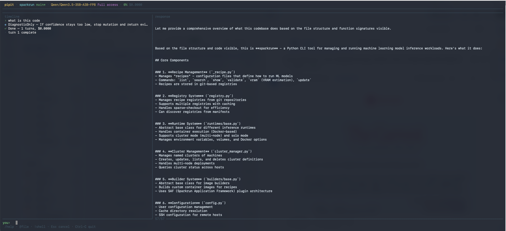

<p align="center">
  
</p>

<p align="center">
  
</p>

```
        _._
       (o >
      / / \
     (_|  /
       " "
```

# Pipit

**Pipit is an autonomous software engineering runtime.**

Build, test, monitor, secure, verify, benchmark, delegate, and evolve architecture — all from one agent workflow. Run interactively, in the background, or across a mesh of specialist agents.

Most coding agents stop at code generation. Pipit keeps going into execution, monitoring, delegation, verification, browser testing, compliance automation, and cross-project learning.

---

## What it does

| Capability | What Pipit does |
|---|---|
| **Code** | Read, edit, refactor, and generate code across any language |
| **Execute** | Run shell commands, build projects, execute tests — with conflict-aware concurrent scheduling |
| **Plan** | Complexity-driven plan gates with expected-cost model; explicit Plan/Execute/Verify phases |
| **Monitor** | Watch files for changes, auto-run tests, detect dependency drift |
| **Secure** | Capability-lattice permissions, taint analysis, vulnerability scanning, signed plugin manifests |
| **Verify** | Cost-gated verification surface, proof packets, confidence scoring, automated repair loops |
| **Comply** | Generate GDPR deletion handlers, audit logging, encryption, consent enforcement |
| **Test** | Headless browser QA: screenshots, console errors, accessibility audits, visual regression |
| **Benchmark** | Compare models, prompts, and tools with checkpoint telemetry and latency budgets |
| **Delegate** | Subagent lineage DAG with merge contracts, capability inheritance, and hard-gate predicates |
| **Evolve** | NSGA-II architecture evolution, Pareto-optimal candidate scoring, scaffold generation |
| **Integrate** | GitHub PRs, Slack/Discord messaging, MCP servers, IDE bridge with session teleportation |
| **Learn** | Event-sourced session ledger, adaptive 4-tier context memory, cross-repo federated knowledge |

---

## Use cases

### Autonomous repo maintainer

Keep a repo healthy without waiting for a human to remember. Fix failing builds incrementally, run verification loops before commit, watch for dependency and security issues, and background long tasks with `/bg`.

### Background engineering teammate

Queue backlog work: "clean up warnings across the repo," "add tests around this module," "refactor these three services in the background," "prepare a code review summary while I work on something else." Pipit supports background execution, loops, saved sessions, checkpoints, and persistent memory.

### Frontend QA and browser testing

Open a staging URL, take screenshots, collect console errors, detect failed network requests, click through flows, type into forms, run accessibility audits, and diff screenshots for visual regressions. Pipit functions as a lightweight web QA agent.

### Dependency hygiene and supply-chain risk

Scan Cargo, npm, Python, and Go manifests. Query OSV for known vulnerabilities. Catch stale or risky dependencies during maintenance windows. Turn dependency health into a recurring workflow via watch mode.

### Compliance implementation

Turn compliance requirements into actual code changes: deletion handlers for personal data, audit logging injection, encryption before storage, retention rules, consent checks before collection. This is compliance-to-change-plan automation.

### Verification for critical paths

For auth logic, payment flows, migration safety, and infrastructure automation. Pipit stores machine-checkable proof artifacts and invalidates them when the code hash changes. Failed verification feeds back into context so the agent can repair the issue.

### Benchmarking agent quality

Compare models, prompting strategies, and tool configurations over repeatable task suites. Track history, measure turns by latency, tokens, tools used, and cost, with productivity scoring.

### Distributed specialist-agent workflows

Route a Rust perf task to the Rust/performance agent. Route a Python test problem to the Python/pytest agent. Route a security task to the node tagged for security audit. The mesh discovers agents by capability and ranks them by similarity.

### Architecture exploration

During monolith-to-microservices planning or early in a project, generate candidate architectures, evaluate them against latency/cost/reliability targets, explore Pareto-optimal options, and scaffold the chosen design.

### Cross-project knowledge reuse

Use `/memory` for persistent local learnings. The federated knowledge store reuses patterns across repos without sharing raw code — only TF-IDF vectors are shared, with configurable privacy policies that block secrets, tokens, and keys.

---

## Quick start

```sh
# Install
curl -fsSL https://raw.githubusercontent.com/sushanthpy/pipit/main/install.sh | sh

# Configure (interactive — asks provider, model, API key, etc.)
pipit setup

# Start coding
pipit
```

`pipit setup` saves your config to `~/.config/pipit/config.toml` so you never have to pass flags again.

---

## Install

**One-line install:**

```sh
curl -fsSL https://raw.githubusercontent.com/sushanthpy/pipit/main/install.sh | sh
```

**Specific version:**

```sh
curl -fsSL https://raw.githubusercontent.com/sushanthpy/pipit/main/install.sh | sh -s v0.1.0
```

**Custom install directory:**

```sh
PIPIT_INSTALL_DIR=~/.local/bin curl -fsSL https://raw.githubusercontent.com/sushanthpy/pipit/main/install.sh | sh
```

**Build from source:**

```sh
git clone https://github.com/sushanthpy/pipit.git
cd pipit
cargo build --release
cp target/release/pipit /usr/local/bin/
```

---

## Setup

Run `pipit setup` to configure interactively:

```
$ pipit setup

  pipit setup
  Interactive configuration wizard

  Provider
  Supported: anthropic, openai, deepseek, google, openrouter,
             ollama, groq, cerebras, mistral, xai, openai_compatible

  Provider [anthropic]: openai
  Model [gpt-4o]: gpt-4o
  API Key: sk-...

  Approval Mode
    suggest     — read-only, ask before every change
    auto_edit   — auto-apply edits, ask for commands
    full_auto   — autonomous, no confirmation needed
  Approval mode [full_auto]: full_auto

  Max turns [25]: 25

  ✓ Config saved to ~/.config/pipit/config.toml
```

This generates a config file:

```toml
# ~/.config/pipit/config.toml
approval = "full_auto"

[provider]
default = "openai"

[model]
default_model = "gpt-4o"

[context]
max_turns = 25
```

You can also use a **local model** (Ollama, vLLM, etc.):

```
Provider: openai_compatible
Model: Qwen/Qwen3.5-35B-A3B-FP8
Base URL: http://localhost:8000
```

Or skip setup and pass flags directly:

```sh
pipit --provider anthropic --model claude-sonnet-4-20250514 --api-key sk-...
```

Or use environment variables:

```sh
export ANTHROPIC_API_KEY=sk-...
pipit
```

---

## Full-screen TUI

Pipit launches a full-screen terminal UI by default with a two-column layout:

```
┌─ status ───────────────────────────────────────────────────────────┐
│ pipit · repo · main · gpt-4o · Full access · 12% $0.0042          │
├─ task / phase ─────────────────────────────────────────────────────┤
│ task: fix the login bug            phase: executing                │
├─ timeline ──────────────┬─ response ───────────────────────────────┤
│ › fix the login bug     │ The issue is in `auth.rs` line 42.      │
│ ○ Read src/auth.rs      │ The session token check uses `==`       │
│ ● Edit src/auth.rs      │ instead of `eq()` for string compare.   │
│ ▸ $ cargo test          │                                          │
│ ✓ edit_file done        │ I've fixed it and the tests pass.       │
│ · turn 1 complete       │                                          │
├─ composer ─────────────────────────────────────────────────────────┤
│ you› _                                                             │
│ /help · @file · !shell · Esc cancel · Ctrl-C quit                 │
└────────────────────────────────────────────────────────────────────┘
```

- **Status bar** — repo, branch, model, approval mode, token usage, cost
- **Timeline** (left) — compact log of agent actions (reads, edits, shell commands)
- **Response** (right) — full model output and streaming text
- **Composer** (bottom) — type your prompt, see hints for commands

Use `--classic` for the old-style REPL if you prefer:

```sh
pipit --classic
```

---

## Commands

| Command | Description |
|---------|-------------|
| **Navigation** | |
| `/help` | Show full help with examples |
| `/status` | Show repo, model, tokens, cost |
| `/cost` | Token cost summary with sparkline |
| `/clear` | Reset context and chat history |
| `/quit` or `/q` | Exit pipit |
| **Context** | |
| `/context` or `/ctx` | Show context window with 4-tier budget visualization |
| `/add <file>` | Add file to working set |
| `/drop <file>` | Remove file from working set |
| `/tokens` | Token usage breakdown |
| `/compact` | Compress context to free tokens |
| `/memory` | Persistent cross-session knowledge |
| **Workflows** | |
| `/plan [goal]` | Enter plan-first mode (auto-gated for complex tasks) |
| `/verify [scope]` | Run build/lint/test checks (cost-gated triggering) |
| `/aside <question>` | Quick side question without changing context |
| `/bg` | Send current task to background |
| `/loop [n]` | Re-run last prompt N times |
| `/save` / `/resume` | Save and restore sessions via ledger replay |
| `/undo` | Undo last agent edit with rollback checkpoint |
| `/export` | Export conversation to markdown/JSON |
| **Git** | |
| `/commit` | Stage and commit changes |
| `/push` | Push commits to remote |
| `/pr` | Create or manage pull requests |
| `/diff` | Show changes in working tree |
| `/branch` | Create or switch branches |
| **Review** | |
| `/review` | Code review with structured findings |
| `/security-review` | Security audit |
| `/lint` | Run linter |
| `/test` | Run tests |
| **Config** | |
| `/config` | Edit configuration |
| `/model` | Switch model at runtime |
| `/provider` | Switch provider |
| `/approval` | Change approval mode / permission rules |
| `/skills` | List discovered skills |
| **Diagnostics** | |
| `/doctor` | System diagnostics (git, config, API keys, skills, MCP) |
| `/bench run <suite>` | Run a benchmark suite |
| `/bench results` | Show latest results |
| **Monitoring** | |
| `/watch start` | Start file watcher with proactive suggestions |
| `/watch stop` | Stop the watcher |
| `/watch deps` | Watch dependency manifests |
| **Testing** | |
| `/browse <url>` | Navigate headless browser |
| `/browse screenshot` | Take a screenshot |
| `/browse visual-diff` | SSIM visual regression |
| **Integration** | |
| `/github` or `/gh` | GitHub operations (PR, issues, CI status) |
| `/slack` | Slack integration |
| `/mcp status` | Show connected MCP servers |
| `/mcp tools` | List available MCP tools |
| `/bridge` | IDE bridge management |
| **Mesh** | |
| `/mesh status` | Show discovered mesh nodes |
| `/mesh delegate <task>` | Delegate to best-fit node |

### Grammar

```
/command           Slash commands (see above)
@file.rs           Attach file as context
!ls -la            Run shell command directly
↑ ↓                Scroll timeline
Esc                Cancel running agent
Ctrl-C             Quit
```

### Examples

```sh
# Ask about code
explain this codebase

# Attach a file and ask about it
@src/main.rs fix the panic on line 42

# Run a shell command through the agent
!cargo test -- --nocapture

# Add context and plan
/add src/lib.rs
/plan refactor the error handling
```

---

## Agent modes

Pipit supports four agent modes that control how much verification happens:

```sh
pipit --mode fast       # Default. Single executor loop, no verification.
pipit --mode balanced   # Verify only when the agent mutates files.
pipit --mode guarded    # Full Plan → Execute → Verify cycle with repair loops.
pipit --mode custom     # Guarded + role-specific model overrides.
```

| Mode | Planning | Verification | Repair | Use case |
|------|----------|-------------|--------|----------|
| `fast` | No | No | No | Quick questions, exploration |
| `balanced` | No | On mutation | No | Day-to-day editing |
| `guarded` | Yes | Always | Up to 2 | Critical changes, refactors |
| `custom` | Yes | Always | Up to 2 | Multi-model setups |

### Custom mode with different models

Use a fast model for execution and a strong model for planning/verification:

```sh
pipit --mode custom \
  --planner-model claude-sonnet-4-20250514 \
  --planner-provider anthropic \
  --verifier-model claude-sonnet-4-20250514 \
  --verifier-provider anthropic
```

---

## Approval modes

Control how much autonomy the agent has:

| Mode | What it does |
|------|-------------|
| `suggest` | Read-only. Ask before every change. |
| `auto_edit` | Auto-apply file edits, ask before shell commands. |
| `full_auto` | Fully autonomous, no confirmations. |

```sh
pipit --approval suggest     # Conservative
pipit --approval auto_edit   # Default
pipit --approval full_auto   # Full autonomy
```

---

## Configuration

Pipit resolves config from multiple layers (later wins):

1. Compiled defaults
2. `/etc/pipit/config.toml` (system-wide)
3. `~/.config/pipit/config.toml` (user — created by `pipit setup`)
4. `.pipit/config.toml` (project-level)
5. `PIPIT_*` environment variables
6. CLI flags (highest priority)

### Environment variables

```sh
export PIPIT_PROVIDER=openai
export PIPIT_MODEL=gpt-4o
export PIPIT_APPROVAL_MODE=full_auto
export PIPIT_MAX_TURNS=25
```

### Project-level config

Create `.pipit/config.toml` in your project root to set project-specific defaults:

```toml
# .pipit/config.toml
approval = "full_auto"

[model]
default_model = "claude-sonnet-4-20250514"

[context]
max_turns = 30
```

---

## Supported providers

| Provider | Env var | Example model |
|----------|---------|---------------|
| Anthropic | `ANTHROPIC_API_KEY` | `claude-sonnet-4-20250514` |
| OpenAI | `OPENAI_API_KEY` | `gpt-4o` |
| DeepSeek | `DEEPSEEK_API_KEY` | `deepseek-chat` |
| Google | `GOOGLE_API_KEY` | `gemini-2.5-flash` |
| OpenRouter | `OPENROUTER_API_KEY` | `anthropic/claude-sonnet-4-20250514` |
| xAI | `XAI_API_KEY` | `grok-3` |
| Cerebras | `CEREBRAS_API_KEY` | `llama-4-scout-17b-16e-instruct` |
| Groq | `GROQ_API_KEY` | `llama-4-scout-17b-16e-instruct` |
| Mistral | `MISTRAL_API_KEY` | `mistral-large-latest` |
| Ollama | — | `qwen2.5-coder:14b` |
| OpenAI-compatible | `OPENAI_API_KEY` | Any (set `--base-url`) |

### Local models

Works with any OpenAI-compatible endpoint (vLLM, Ollama, LMStudio, etc.):

```sh
# vLLM
pipit --provider openai_compatible --base-url http://localhost:8000 --model Qwen/Qwen3.5-35B-A3B-FP8 --api-key dummy

# Ollama
pipit --provider ollama --model qwen2.5-coder:14b
```

---

## Authentication

```sh
# Store an API key
pipit auth login openai --api-key sk-...

# Use OAuth device flow (if supported)
pipit auth login google --device

# Check status
pipit auth status

# Remove credentials
pipit auth logout openai
```

Credentials are stored in `~/.pipit/credentials.json`.

---

## Single-shot mode

Pass a prompt directly for non-interactive use:

```sh
# Ask a question
pipit "what does the main function do?"

# Fix something with limited turns
pipit --max-turns 5 "fix the failing test in src/auth.rs"

# Use in CI/scripts
pipit --approval full_auto --max-turns 10 "run the tests and fix any failures"
```

---

## Platform capabilities

### Agent runtime

Pipit is not a one-shot assistant. It has a hexagonal kernel architecture where every subsystem communicates through typed ports — zero global mutable state.

- **Event-sourced sessions** — Every mutation is a typed `SessionEvent` in a hash-chained ledger. Crash recovery is deterministic replay. Resume is a real feature, not "restore messages and hope."
- **Capability-lattice permissions** — Tool authorization is a single `PolicyKernel::evaluate()` call with O(1) bitset subset checks. Scoped rules support path prefix, command pattern, and per-run/permanent duration.
- **Concurrent tool scheduling** — The scheduler builds a resource-conflict graph and runs independent tool calls concurrently. Reads overlap; writes serialize.
- **Background tasks** — `/bg` to send work to the background
- **Loop execution** — `/loop [n]` to re-run prompts on a cadence
- **Checkpoints** — Undo and replay from any point via ledger snapshots

### RepoMap and code intelligence

Pipit automatically indexes your project to understand file structure, symbols, and dependencies. LSP integration provides goto-definition, find-references, and hover info to the agent. This gives project-wide awareness without reading every file.

### Proof packets and verification

Every run produces a proof packet — a structured record of what the agent planned, what it did, and what confidence it has. Proof artifacts are machine-checkable and auto-invalidate when the associated code hash changes. Use `/plans` to review them.

### Ambient monitoring

`/watch` is more than a convenience command. Pipit passively monitors repo state and can check deps, tests, and security over time:

```sh
/watch start          # Watch for file changes, auto-suggest actions
/watch stop           # Stop the watcher
/watch deps           # Watch dependency manifests for drift
```

### Context survival

The adaptive context controller manages a 4-tier memory hierarchy: Pinned (user objective, plan — never evicted), Active (recent edits, tool results), Historical (older turns, summaries), and Exhaust (stale readings — evict first). Retention uses greedy knapsack by utility-per-token with recency decay. The transport layer shrinks older history into a local summary when the provider rejects oversized requests. Longer-running autonomous sessions don't die — they degrade gracefully.

### Cross-session memory

`/memory`, saved sessions, checkpoints, and persistent knowledge mean Pipit is built for continuity. The storage layer supports embeddings for tasks and nearest-neighbor search over similar tasks, plus storage of knowledge units extracted from completed work:

- "Have we solved a similar production issue before?"
- "Reuse the same refactor pattern from another service"
- "Retrieve comparable tasks before planning a fix"

### Skills, agents, and hooks

Place files in `.pipit/` for project-specific customization:
- `.pipit/skills/` — Compiled skills with trigger matching (path, language, dependency), sandbox contracts, trust tiers, and budget allocation
- `.pipit/agents/` — Custom agent definitions
- `.pipit/hooks/` — Lifecycle hooks (PreToolUse, PostToolUse, SessionStart, etc.) with shell/command execution and environment variables
- `.pipit/rules/` — Project rules and constraints
- `.pipit/permissions.json` — Persisted permission rules with scope, duration, and resource restrictions

---

## Multi-agent mesh

The mesh layer is not just "many agents." It includes capability registration, capability-based discovery, ranked matching via cosine similarity, typed schema negotiation, delegation, node mesh lifecycle, join/gossip behavior, and CRDT-backed shared state.

### Specialist-agent routing

Route work to the best specialist automatically. The registry ranks agents by similarity across tools, languages, projects, and tags — not simple string match.

```sh
/mesh status          # Show discovered mesh nodes
/mesh delegate <task> # Delegate to the best-fit node
```

### Contract-safe delegation

Agents collaborate without breaking each other. The planner defines the expected output schema, the worker counters with what it can return, and the protocol computes a strict intersection. Tasks proceed only on the agreed contract via a three-phase protocol with type intersection rules.

### Peer-to-peer engineering swarm

The mesh daemon manages node lifecycle and supports joining via a seed node, with a gossip listener and periodic gossip sender using SWIM-style pinging:

- Scale work across local lab machines
- Resilient local-network collaboration
- Ad hoc team compute swarms
- Coordinator + worker node topologies

### Federated knowledge without sharing code

Cross-repository learning where sharing is opt-in and privacy-preserving. Only TF-IDF vectors are shared, not raw code. The federation policy blocks terms like `password`, `secret`, `token`, `api_key`, and `private_key`.

---

## Browser automation

Pipit includes a headless browser layer for web QA:

```sh
/browse <url>         # Navigate to a URL
/browse screenshot    # Take a screenshot
/browse console       # Show console output
/browse network       # Show network requests
/browse click <sel>   # Click an element
/browse type <sel>    # Type into a form field
/browse a11y          # Run accessibility audit
/browse visual-diff   # SSIM-based visual regression
```

### What you can do

- Open staging URLs and take screenshots
- Collect console errors and failed network requests
- Click through user flows and type into forms
- Run accessibility and Lighthouse-style audits
- Diff screenshots between runs for visual regressions

---

## Dependency and supply-chain scanning

Cross-ecosystem dependency analysis:

```sh
/deps audit           # Security audit via OSV
/deps outdated        # Show outdated packages
/deps tree            # Dependency tree visualization
```

Scans Cargo, npm, Python, and Go manifests. Detects which ecosystems are present. Queries the OSV database for known vulnerabilities. Works as a recurring workflow via watch mode.

---

## Compliance automation

Turn compliance requirements into code changes, not just advice:

| Requirement | What Pipit generates |
|---|---|
| Data deletion | Deletion handlers for personal data fields |
| Audit logging | Logging injection at data access points |
| Encryption | Encryption-before-storage wrappers |
| Retention | Retention policy enforcement rules |
| Consent | Consent checks before collection/processing |

The compliance layer parses requirements and generates change plans with taint analysis on modified files.

---

## Benchmarking

Evaluate agent performance with a built-in framework:

```sh
/bench run <suite>    # Run a benchmark suite
/bench results        # Show latest results
/bench compare        # Compare runs side-by-side
```

Profile turns by latency, tokens, tools used, and cost. Track history across benchmark runs. Measure engineering output quality over time with productivity scoring.

---

## Architecture evolution

Generate and evaluate architecture options:

- Monolith-to-service decomposition
- Compare latency / cost / reliability tradeoffs
- Explore Pareto-optimal candidates
- Choose between sync RPC, async messaging, event stream, shared DB
- Scaffold the chosen design

---

## MCP and A2A protocol

Connect to external tool servers using the Model Context Protocol. Pipit also implements Google's Agent-to-Agent (A2A) protocol for inter-agent communication.

```sh
/mcp status           # Show connected MCP servers
/mcp tools            # List available MCP tools
```

Configure MCP servers in `.pipit/mcp.json`:
```json
{
  "servers": {
    "filesystem": {
      "command": "npx",
      "args": ["-y", "@modelcontextprotocol/server-filesystem", "/path/to/dir"]
    }
  }
}
```

Install community extensions:
```sh
/plugins list
/plugins install <path>
/plugins uninstall <name>
```

---

## Multi-channel ingress

The channel abstraction supports inbound work from Telegram, Discord, HTTP API, webhooks, and cron. Pipit doesn't have to stay a terminal product — it can become a chatops bot, a webhook-driven automation layer, a scheduled maintenance agent, or an API-exposed engineering worker.

---

## CLI reference

```
pipit [OPTIONS] [PROMPT] [COMMAND]

Arguments:
  [PROMPT]    Initial prompt (runs non-interactively)

Commands:
  setup       Interactive setup wizard
  auth        Manage provider authentication
  update      Update pipit to the latest version

Options:
  -p, --provider <PROVIDER>    LLM provider
  -m, --model <MODEL>          Model name
      --api-key <KEY>          API key
  -a, --approval <MODE>        suggest, auto_edit, full_auto
      --root <PATH>            Project root
      --base-url <URL>         Custom LLM endpoint
      --mode <MODE>            fast, balanced, guarded, custom
      --max-turns <N>          Max agent turns per prompt
      --classic                Use classic REPL instead of TUI
      --thinking               Show model reasoning (default: true)
      --trace-ui               Show detailed tool traces
  -h, --help                   Print help
  -V, --version                Print version
```

---

## Who is this for

| Team | Why Pipit fits |
|---|---|
| **Platform engineering** | Automate repo maintenance, dependency hygiene, and CI health across many services |
| **Developer productivity / internal tools** | Replace manual workflows with persistent, repeatable agent workflows |
| **Security and compliance** | Continuous taint analysis, vulnerability scanning, and compliance-to-code automation |
| **Infrastructure teams** | Background maintenance, verification loops, and self-healing CI for critical systems |
| **Teams evaluating multi-agent delivery** | Mesh coordination with capability-based routing and contract-safe delegation |

---

## Architecture

Pipit is a Rust workspace with 31 crates and a hexagonal kernel architecture. All subsystems communicate through typed ports — no global mutable state.

### Kernel & Control Plane

| Subsystem | Module | What it does |
|---|---|---|
| **Policy Kernel** | `capability.rs` | Capability-lattice permission system with O(1) bitset subset checks. All tool authorization flows through `PolicyKernel::evaluate()` — no per-tool approval logic. Permission rules support scoped grants: path prefix, command pattern, MCP server, with per-run or permanent duration. |
| **Session Ledger** | `ledger.rs` | Append-only, hash-chained event log. Every state mutation is a typed `SessionEvent`. Crash recovery is deterministic replay via `SessionState::reduce()`. Snapshot acceleration gives O(k+Δ) restore. |
| **Scheduler** | `scheduler.rs` | Conflict-aware concurrent tool execution. Builds a resource-conflict graph, partitions into maximal independent sets, runs batches concurrently. Read-read is parallel; any write serializes. |
| **Semantic Types** | `tool_semantics.rs` | Closed `SemanticClass` sum type (`Read|Edit|Exec|Delegate|External|Pure`). Single derivation point for policy, evidence, risk, and scheduling — replaces all string dispatch. |
| **Turn Kernel** | `turn_kernel.rs` | Pure Mealy machine over turn phases (Idle→Planning→Requesting→Streaming→ToolRunning→Verifying→Done). Side-effect free for deterministic simulation tests. |
| **Lineage DAG** | `lineage.rs` | Subagent execution branches with capability inheritance (lattice meet), token budgets, merge contracts, and hard-gate predicates. |
| **Two-Phase Commit** | `two_phase.rs` | Speculative execution with verification gating. File snapshot checkpointing for rollback. |

### Tool & Skill System

| Subsystem | Module | What it does |
|---|---|---|
| **Tool Trait** | `pipit-tools/lib.rs` | `is_mutating()` and `requires_approval()` are default methods derived from the semantic type system. Individual tools never override authorization. |
| **MCP Lazy Loading** | `pipit-mcp/lib.rs` | Servers with >20 tools are indexed, not eagerly registered. An `mcp_search` meta-tool does BM25 search + on-demand invocation. |
| **Skill Kernel** | `skill_kernel.rs` | Compiled skills with trigger matching (path, language, dependency), sandbox contracts, trust tiers, and budget allocation via greedy knapsack. |
| **Skill Runtime** | `skill_runtime.rs` | Bridges discovery→kernel→activation→budget→prompt injection. Skills are typed control objects, not loose prompt content. |
| **Tool Interrupt** | `tool_interrupt.rs` | Per-tool interrupt semantics: CancelImmediate (reads), MustComplete (atomic writes), FinishUnit (shell), CancelAndRollback (destructive). |

### Observability & Verification

| Subsystem | Module | What it does |
|---|---|---|
| **Runtime Events** | `events.rs` | `RuntimeEvent` with monotonic sequence numbers and `RuntimeEventBuffer` for replayable multi-consumer fanout. |
| **Engine Protocol** | `sdk.rs` | Versioned wire protocol (v2) with 20+ typed events covering the full turn lifecycle. All surfaces (CLI/TUI/SDK/daemon) consume the same stream. |
| **Telemetry Facade** | `telemetry_facade.rs` | OTel-compatible spans, per-session counters with Kahan summation for cost precision, reservoir sampling for high-cardinality metrics. |
| **Query Profiler** | `query_profiler.rs` | Checkpoint-based latency tracking (TTFT, tool time, verification time) with percentile computation and budget violation detection. |
| **Verification Surface** | `verification_surface.rs` | Cost-gated verification: triggers when `C_v < p × R_e`. Adaptive defect probability. Renders structured findings. |

### Integration Ports

| Port | Module | What it does |
|---|---|---|
| **ForgePort** | `integration_ports.rs` | PR create, review comments, CI status, issue management, GitHub App installation. Forge-agnostic (GitHub/GitLab/Bitbucket). |
| **MessagingPort** | `integration_ports.rs` | Send/notify/install for Slack, Discord, Telegram. Session-to-thread mapping. |
| **TeamPort** | `integration_ports.rs` | Team CRUD, RBAC with capability mask intersection, cost budgets, path restrictions. |
| **Bridge Protocol** | `bridge_protocol.rs` | JWT auth, transport negotiation (WebSocket→SSE→HTTP-poll fallback), bounded replay buffer, session teleportation via ledger snapshot+replay. |

### Developer Experience

| Subsystem | Module | What it does |
|---|---|---|
| **Command Registry** | `command_registry.rs` | 38 built-in slash commands with trie-prefix matching, Levenshtein fuzzy completion, typed args, category grouping. |
| **Plugin Registry** | `plugin_registry.rs` | Signed manifests (Ed25519 + SHA-256), install/uninstall lifecycle, dependency resolution. |
| **DX Surface** | `dx_surface.rs` | `/doctor` diagnostics (6 checks), cost sparkline visualization, context budget stacked bar, theme system. |
| **Plan Gate** | `plan_gate.rs` | Expected-cost model: require plan review when `C_plan < p × R`. Complexity scoring from file count, ambiguity, scope. |
| **Adaptive Context** | `adaptive_context.rs` | 4-tier memory (Pinned/Active/Historical/Exhaust) with utility-per-token scoring and greedy knapsack retention. |
| **Editor Integration** | `editor_integration.rs` | Vim state machine + agent runtime composition. Approval review mode, read-only mode, agent-assisted edit tracking. |
| **Worktree Sessions** | `worktree_session.rs` | `pipit worktree up/down` with git isolation, tmux layout, session restoration, clean merge semantics. |

### Crate Map

| Layer | Crates |
|---|---|
| **CLI + TUI** | `pipit-cli`, `pipit-io` |
| **Core runtime** | `pipit-core` (50 modules), `pipit-config`, `pipit-context`, `pipit-extensions` |
| **Agent intelligence** | `pipit-intelligence`, `pipit-skills`, `pipit-edit`, `pipit-lsp` |
| **Providers** | `pipit-provider` (Anthropic, OpenAI, Google, DeepSeek, Ollama, etc.) |
| **Tools** | `pipit-tools`, `pipit-browser`, `pipit-deps`, `pipit-mcp` |
| **Verification** | `pipit-verify`, `pipit-compliance`, `pipit-spec` |
| **Mesh** | `pipit-mesh`, `pipit-agent-mesh`, `pipit-channel` |
| **Evolution** | `pipit-arch-evolution`, `pipit-evolve`, `pipit-hw-codesign` |
| **Operations** | `pipit-daemon`, `pipit-bench`, `pipit-perf`, `pipit-env` |
| **Integration** | `pipit-bridge`, `pipit-voice` |

---

## License

MIT