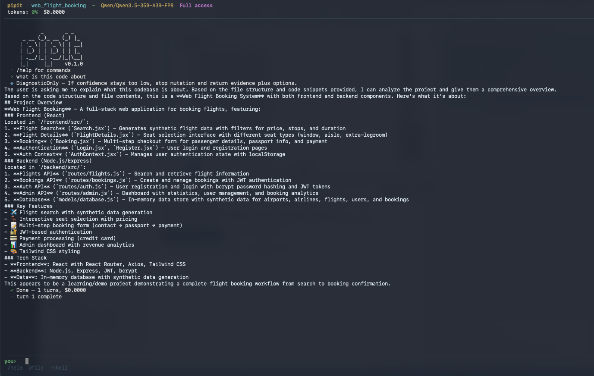

<p align="center">
  
</p>

# Pipit

**Pipit is an AI coding agent for the terminal.**  
It helps you read code, edit files, run shell commands, inspect a project, and work through coding tasks with an LLM — without leaving your terminal.

Pipit is built for real codebases, not toy prompts.

---

## Install

```sh
curl -fsSL https://raw.githubusercontent.com/sushanthpy/pipit/main/install.sh | sh
```

Or specify a version:

```sh
curl -fsSL https://raw.githubusercontent.com/sushanthpy/pipit/main/install.sh | sh -s v0.1.0
```

Set a custom install directory:

```sh
PIPIT_INSTALL_DIR=~/.local/bin curl -fsSL https://raw.githubusercontent.com/sushanthpy/pipit/main/install.sh | sh
```

Or build from source:

```sh
git clone https://github.com/sushanthpy/pipit.git
cd pipit
cargo build --release
cp target/release/pipit /usr/local/bin/
```

---

## Why Pipit?

Pipit gives you a simple terminal interface for day-to-day coding work:

- ask questions about a codebase
- make focused code changes
- run commands and inspect output
- keep files in working context
- switch between approval levels
- save and resume sessions
- use custom project skills, commands, rules, and hooks

It aims to feel lightweight for quick tasks, while still supporting more advanced agent workflows.

---

## What Pipit can do

- **Read, write, and edit code files**
- **Run shell commands**
- **Search a repo with grep and glob**
- **Build a RepoMap for project awareness**
- **Work in single-shot or interactive mode**
- **Run in classic REPL or full-screen TUI mode**
- **Track plans, proof packets, and checkpoints**
- **Save and resume sessions**
- **Load project-specific skills, commands, agents, rules, and hooks**

---

## Supported providers

Pipit supports multiple LLM providers and compatible endpoints, including:

- Anthropic
- OpenAI
- DeepSeek
- Google
- OpenRouter
- xAI
- Cerebras
- Groq
- Mistral
- Ollama
- OpenAI-compatible endpoints
- Anthropic-compatible endpoints

That means you can use the model setup that fits your workflow, whether it is a hosted API or a local-compatible endpoint.

---

## Install

Right now, the project looks like a Rust workspace, so the clearest way to use Pipit is to build it from source.

```bash
git clone <your-repo-url>
cd pipit
cargo build --release
./target/release/pipit --help